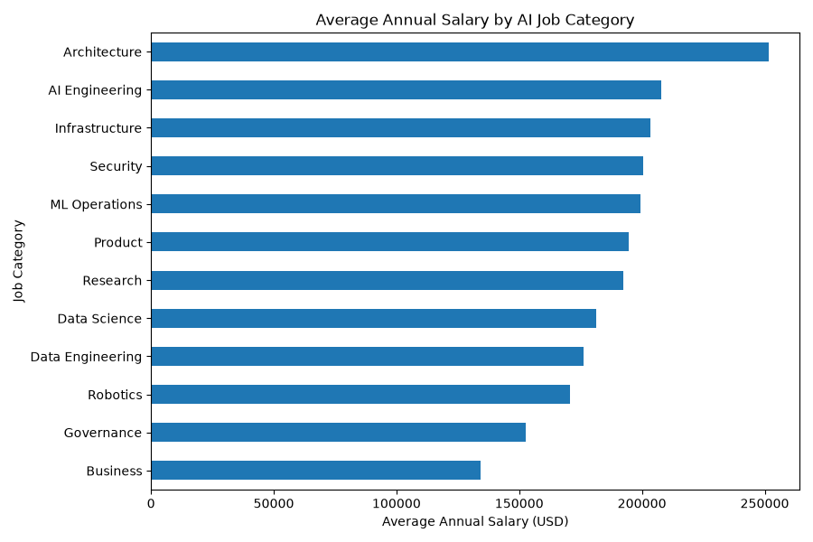
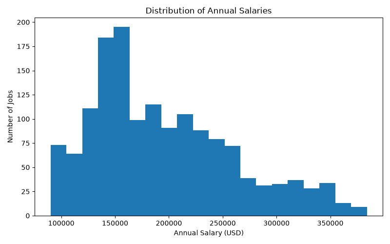
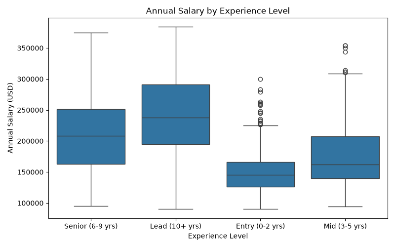
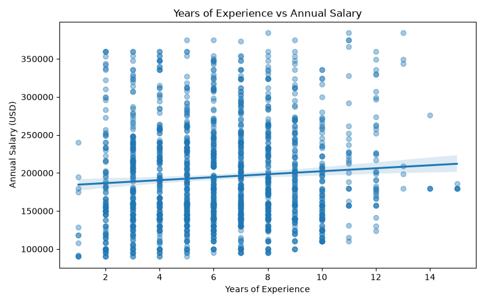

# IDS706-AI-Jobs-Project
# AI Jobs Market Analysis

## Project Overview

This project explores an AI jobs market dataset containing 1,500 job postings and 25 variables. The dataset includes information about job titles, job categories, experience requirements, salaries, locations, remote work options, industries, and AI-related job characteristics.

The goal of this project is to practice basic data analysis using Pandas, create visualizations with Matplotlib and Seaborn, and explore a simple machine learning algorithm. I use linear regression to examine whether years of experience can help predict annual salary.

## Dataset

The dataset used in this project, `ai_jobs_market_2025_2026.csv`, was obtained from Kaggle [here](https://www.kaggle.com/datasets/alitaqishah/ai-jobs-market-2025-2026-salaries).

It contains 1,500 observations and 25 columns.

Some important variables include:

- `job_title`: Title of the AI-related position
- `job_category`: General category of the position
- `experience_level`: Required experience level
- `years_of_experience`: Number of years of experience
- `annual_salary_usd`: Annual salary in U.S. dollars
- `country`: Country associated with the job
- `remote_work`: Whether the position is on-site, hybrid, or fully remote
- `industry`: Industry of the employer
- `demand_score`: Measure of demand for the position
- `is_llm_role`: Indicates whether the position is related to large language models

## Project Structure

```text
IDS706-AI-Jobs-Project/
├── ai_jobs_market_2025_2026.csv
├── analysis.py
├── polars_comparison.py
├── README.md
└── requirements.txt
```

## Setup

The project uses Python and the following packages:

- pandas
- polars
- matplotlib
- seaborn
- scikit-learn

Install the required packages with:

```bash
python3 -m pip install -r requirements.txt
```

Run the analysis with:

```bash
python3 analysis.py
```

Run the Pandas and Polars performance comparison with:

```bash
python3 polars_comparison.py
```

## Data Inspection

I first loaded the dataset using Pandas and inspected it using:

- `.head()` to view the first five rows
- `.info()` to examine the number of observations, columns, and data types
- `.describe()` to examine summary statistics
- `.isnull().sum()` to check for missing values
- `.duplicated().sum()` to check for duplicated rows

The dataset contains **1,500 rows and 25 columns**. There are **no missing values** and **no duplicated rows**.

The mean annual salary is approximately **$194,892**, while the median annual salary is **$180,000**. Salaries range from **$90,000 to $384,000**.

## Filtering

I created several subsets of the dataset to explore different parts of the AI job market.

The analysis found:

- **515** jobs located in the USA
- **445** fully remote jobs
- **148** jobs that are both fully remote and located in the USA
- **607** jobs with an annual salary above $200,000

These filters demonstrate how Pandas can be used to select observations based on one or multiple conditions.

## Grouping

I grouped the data by `job_category` to compare salaries across different types of AI jobs.

The category with the highest average annual salary was **Architecture**, at approximately **$251,577**.

Some other average salaries were:

- AI Engineering: approximately $207,982
- Infrastructure: approximately $203,527
- Security: approximately $200,400
- Data Science: approximately $181,276
- Governance: approximately $152,516
- Business: approximately $134,145

The dataset contains substantially more AI Engineering jobs than any other category, with **736 AI Engineering positions**.

## Visualizations

### 1. Average Annual Salary by AI Job Category

This horizontal bar chart compares the average annual salary across AI job categories.



The visualization shows substantial salary differences between job categories. Architecture has the highest average salary, while Business and Governance are among the lower-paying categories in this dataset.

### 2. Distribution of Annual Salaries

This histogram shows the overall distribution of annual salaries in the dataset.



The salaries cover a wide range, from $90,000 to $384,000, with an average salary of approximately $194,892.

### 3. Annual Salary by Experience Level

This boxplot compares salary distributions across different experience levels.



The plot helps show both the typical salary and the variation in salaries within each experience-level group.

### 4. Years of Experience vs. Annual Salary

This scatter plot examines the relationship between years of experience and annual salary.



The points show substantial salary variation even among jobs requiring similar numbers of years of experience. This suggests that years of experience alone may not be enough to explain differences in salary.

## Machine Learning

For the machine learning portion of the project, I used a **Linear Regression** model.

The goal was to explore whether `years_of_experience` could be used to predict `annual_salary_usd`.

The model uses:

- **Input feature (X):** `years_of_experience`
- **Target (y):** `annual_salary_usd`

I split the dataset into:

- 80% training data
- 20% testing data

A fixed `random_state=42` was used so that the train/test split is reproducible.

The model was trained on the training data and then used to predict salaries for the testing data.

## Model Results

The linear regression produced approximately:

```text
Coefficient: 2779.98
Intercept: 178233.49
Mean Absolute Error: 54663.13
R-squared: -0.028
```

The coefficient indicates that the model associates one additional year of experience with approximately **$2,780 higher predicted annual salary**.

However, the model's **Mean Absolute Error (MAE)** is approximately **$54,663**, meaning its predictions differ from the actual salaries by about $54,663 on average.

The **R-squared value is approximately -0.028**, indicating that years of experience alone performs poorly as a predictor of annual salary on the testing data.

This is an important result rather than simply a failed model. Salary differences in the AI job market may depend on many other factors, such as job category, industry, location, seniority, and specialization. A future version of the project could explore additional features.

## Pandas vs. Polars Performance Comparison

In addition to the Pandas analysis, I used Polars to perform the same dataframe operations and compare their performance. The comparison included filtering jobs in the USA, filtering fully remote jobs, filtering fully remote jobs in the USA, filtering jobs with an annual salary above $200,000, calculating the average salary by job category, and counting the number of jobs by job category.

Each operation was repeated 100 times, and the average execution time was calculated.

The performance results were:

```text
Filter: USA jobs
Pandas: 0.000313 seconds
Polars: 0.001163 seconds

Filter: fully remote jobs
Pandas: 0.000263 seconds
Polars: 0.001013 seconds

Filter: fully remote USA jobs
Pandas: 0.000345 seconds
Polars: 0.000987 seconds

Filter: salary above $200,000
Pandas: 0.000216 seconds
Polars: 0.001025 seconds

Group by job category: average salary
Pandas: 0.000213 seconds
Polars: 0.000750 seconds

Group by job category: job count
Pandas: 0.000172 seconds
Polars: 0.000226 seconds
```

For this dataset, Pandas was faster for filtering and grouping, while Polars was slightly faster for sorting. Since the dataset contains only 1,500 rows, all of the operations completed very quickly and the performance differences were small.

The Pandas and Polars analyses also produced the same results. For example, both returned 515 USA jobs, 445 fully remote jobs, 148 fully remote USA jobs, and 607 jobs with salaries above $200,000. The grouped average salaries and job counts by category were also consistent between the two libraries.

## Key Findings

Overall, this initial analysis found that:

- The dataset is complete, with no missing or duplicated observations.
- About one-third of the job postings are located in the USA.
- There are 445 fully remote positions.
- Average salaries vary substantially across job categories.
- Architecture has the highest average salary among the job categories in this dataset.
- Years of experience alone is not a strong predictor of annual salary.
- Other job characteristics may be important for explaining salary differences.

## Next Steps

This project will be extended in future assignments. Possible next steps include:

- Refactoring the analysis into reusable Python functions
- Adding automated tests with `pytest`
- Improving the machine learning analysis with additional features
- Adding continuous integration
- Containerizing the project with Docker

These additions will make the analysis easier to test, reproduce, and maintain.
