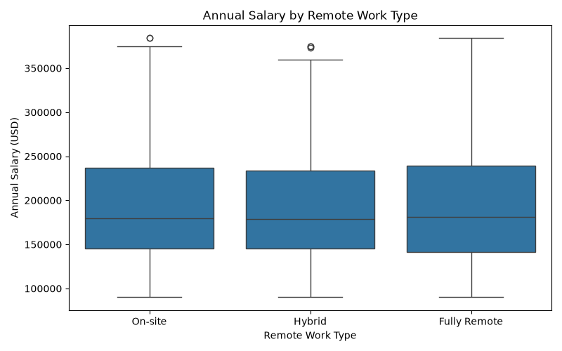
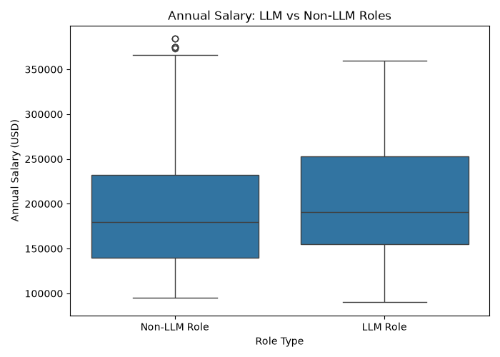
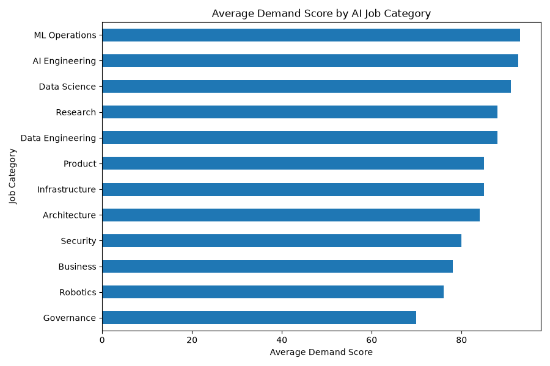
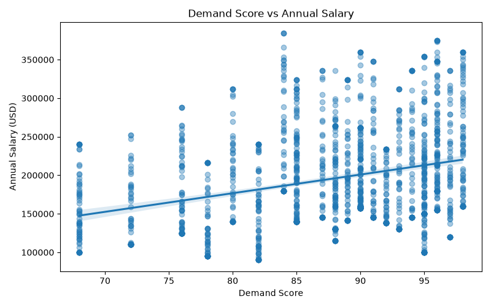

# IDS706-AI-Jobs-Project
# AI Jobs Market Analysis

## Project Overview

This project explores an AI jobs market dataset containing 1,500 job postings and 25 variables. The dataset includes information about job titles, job categories, experience requirements, salaries, locations, remote work options, industries, and AI-related job characteristics.

The project was initially developed as a basic data analysis workflow using Pandas, Matplotlib, Seaborn, and scikit-learn. It has since been refactored into reusable Python functions and extended with automated testing and continuous integration to make the analysis more reproducible and reliable.

The analysis includes:

- Data loading and inspection
- Filtering and grouping
- Exploratory data visualization
- Multiple linear regression for salary prediction
- Pandas and Polars performance comparison
- Unit and system testing with `pytest`
- Continuous integration with GitHub Actions

## Dataset

The dataset used in this project, `ai_jobs_market_2025_2026.csv`, was obtained from Kaggle:

[AI Jobs Market 2025–2026 & Salaries](https://www.kaggle.com/datasets/alitaqishah/ai-jobs-market-2025-2026-salaries)

It contains 1,500 observations and 25 columns.

Some important variables include:

- `job_title`: Title of the AI-related position
- `job_category`: General category of the position
- `experience_level`: Required experience level
- `years_of_experience`: Number of years of experience
- `annual_salary_usd`: Annual salary in U.S. dollars
- `country`: Country associated with the job
- `remote_work`: Whether the position is on-site, hybrid, or fully remote
- `industry`: Industry of the employer
- `demand_score`: Measure of demand for the position
- `is_llm_role`: Indicates whether the position is related to large language models
- `is_senior`: Indicates whether the position is a senior role
- `is_remote_friendly`: Indicates whether the position supports remote work

## Project Structure

```text
IDS706-AI-Jobs-Project/
├── .github/
│   └── workflows/
│       └── test.yml
├── figures/
├── src/
│   ├── part1_wk1-analysis.py
│   └── main.py
├── tests/
│   └── test_main.py
├── ai_jobs_market_2025_2026.csv
├── polars_comparison.py
├── rust_vs_python_intro.ipynb
├── Dockerfile
├── Makefile
├── requirements.txt
└── README.md
```

The original Week 1 analysis is preserved in `part1_wk1-analysis.py`. The refactored analysis is located in `src/main.py`, where the workflow is organized into reusable functions that can be independently tested.

## Setup

The project uses Python and the following packages:

- pandas
- polars
- matplotlib
- seaborn
- scikit-learn
- pytest

Install the required packages with:

```bash
python3 -m pip install -r requirements.txt
```

Run the refactored analysis with:

```bash
python3 src/main.py
```

The script loads and inspects the dataset, performs filtering and grouping operations, trains the machine learning model, and generates the visualizations in the `figures/` directory.

The Pandas and Polars performance comparison can be run separately with:

```bash
python3 polars_comparison.py
```

## Data Inspection

I first loaded the dataset using Pandas and inspected it using:

- `.head()` to view the first five rows
- `.info()` to examine the number of observations, columns, and data types
- `.describe()` to examine summary statistics
- `.isnull().sum()` to check for missing values
- `.duplicated().sum()` to check for duplicated rows

The dataset contains **1,500 rows and 25 columns**. There are **no missing values** and **no duplicated rows**.

The mean annual salary is approximately **$194,892**, while the median annual salary is **$180,000**. Salaries range from **$90,000 to $384,000**.

## Filtering

I created several subsets of the dataset to explore different parts of the AI job market.

The analysis found:

- **515** jobs located in the USA
- **445** fully remote jobs
- **148** jobs that are both fully remote and located in the USA
- **607** jobs with an annual salary above $200,000

These filters demonstrate how Pandas can be used to select observations based on one or multiple conditions.

## Grouping

I grouped the data by `job_category` to compare salaries across different types of AI jobs.

The category with the highest average annual salary was **Architecture**, at approximately **$251,577**.

Some other average salaries were:

- AI Engineering: approximately $207,982
- Infrastructure: approximately $203,527
- Security: approximately $200,400
- Data Science: approximately $181,276
- Governance: approximately $152,516
- Business: approximately $134,145

The dataset contains substantially more AI Engineering jobs than any other category, with **736 AI Engineering positions**.

## Visualizations

### 1. Average Annual Salary by AI Job Category

This horizontal bar chart compares the average annual salary across AI job categories.


The visualization shows substantial salary differences between job categories. Architecture has the highest average salary, while Business and Governance are among the lower-paying categories in this dataset.

### 2. Distribution of Annual Salaries

This histogram shows the overall distribution of annual salaries in the dataset.


The salaries cover a wide range, from $90,000 to $384,000, with an average salary of approximately $194,892.

### 3. Annual Salary by Experience Level

This boxplot compares salary distributions across different experience levels.


The plot helps show both the typical salary and the variation in salaries within each experience-level group.

### 4. Years of Experience vs. Annual Salary

This scatter plot examines the relationship between years of experience and annual salary.


The points show substantial salary variation even among jobs requiring similar numbers of years of experience. This suggests that years of experience alone may not be enough to explain differences in salary.

### 5. Annual Salary by Remote Work Type



This boxplot compares salary distributions for different remote work arrangements.

### 6. Annual Salary: LLM vs. Non-LLM Roles



This visualization compares salary distributions between LLM-related and non-LLM roles.

### 7. Average Demand Score by AI Job Category



This chart compares average demand scores across AI job categories.

### 8. Demand Score vs. Annual Salary



This plot explores whether jobs with higher demand scores also tend to have higher salaries.

## Machine Learning

For the machine learning portion of the project, I used a **Linear Regression** model.

The target variable is:

```text
annual_salary_usd
```

The model uses seven input features:

```text
years_of_experience
demand_score
ai_salary_premium_pct
benefits_score_10
is_senior
is_remote_friendly
is_llm_role
```

The dataset is split into:

- 80% training data
- 20% testing data

A fixed `random_state=42` is used to make the train/test split reproducible.

Model performance is evaluated using:

- **Mean Absolute Error (MAE)**
- **R-squared (R²)**

This expanded model allows salary to be explored using multiple job characteristics instead of relying only on years of experience.

## Model Results

The linear regression produced approximately:

```text
Mean Absolute Error: $43646.35
R-squared: 0.265
```

The MAE indicates that the model's salary predictions differ from the actual salaries by approximately **$43,646** on average.

The R-squared value of approximately **0.265** indicates that the seven features in the model explain about 26.5% of the variation in annual salary in the test data.

Compared with using years of experience alone, the expanded model incorporates additional job characteristics such as demand, AI salary premium, seniority, remote friendliness, and whether the position is LLM-related. However, much of the variation in salary remains unexplained, suggesting that other factors such as job category, industry, location, and company characteristics may also be important.

## Pandas vs. Polars Performance Comparison

In addition to the Pandas analysis, I used Polars to perform the same dataframe operations and compare their performance. The comparison included filtering jobs in the USA, filtering fully remote jobs, filtering fully remote jobs in the USA, filtering jobs with an annual salary above $200,000, calculating the average salary by job category, and counting the number of jobs by job category.

Each operation was repeated 100 times, and the average execution time was calculated.

The performance results were:

```text
Filter: USA jobs
Pandas: 0.000313 seconds
Polars: 0.001163 seconds

Filter: fully remote jobs
Pandas: 0.000263 seconds
Polars: 0.001013 seconds

Filter: fully remote USA jobs
Pandas: 0.000345 seconds
Polars: 0.000987 seconds

Filter: salary above $200,000
Pandas: 0.000216 seconds
Polars: 0.001025 seconds

Group by job category: average salary
Pandas: 0.000213 seconds
Polars: 0.000750 seconds

Group by job category: job count
Pandas: 0.000172 seconds
Polars: 0.000226 seconds
```

For this dataset, Pandas was faster for filtering and grouping, while Polars was slightly faster for sorting. Since the dataset contains only 1,500 rows, all of the operations completed very quickly and the performance differences were small.

The Pandas and Polars analyses also produced the same results. For example, both returned 515 USA jobs, 445 fully remote jobs, 148 fully remote USA jobs, and 607 jobs with salaries above $200,000. The grouped average salaries and job counts by category were also consistent between the two libraries.

## Automated Testing

Automated tests are implemented using **pytest** to verify the reliability of the analysis workflow.

The test suite includes checks for:

- Data loading
- USA job filtering
- Fully remote USA job filtering
- High-salary job filtering
- High-salary filtering edge case
- Salary grouping by job category
- Machine learning model training and evaluation
- Complete system execution and visualization generation

The edge-case test verifies that using an extremely high salary threshold correctly returns an empty DataFrame.

The machine learning test verifies that the model is successfully trained using all seven features and that valid evaluation metrics are returned.

The system test runs the complete `main()` workflow and confirms that all eight expected visualization files are successfully generated.

Run all tests with:

```bash
pytest
```

or with the Makefile:

```bash
make test
```

A successful test run should show:

```text
8 passed
```

## Continuous Integration

This project uses **GitHub Actions** for continuous integration.

Whenever changes are pushed to the repository, the CI workflow automatically sets up the Python environment, installs the required dependencies, and runs the test suite.

This ensures that changes to the project do not accidentally break the data analysis workflow.

The CI status badge at the top of this README provides a quick indication of whether the latest GitHub Actions workflow completed successfully.

## Makefile

A `Makefile` is included to provide simple and reproducible commands for common development tasks.

For example:

```bash
make install
make test
```

This makes dependency installation and automated testing easier to run consistently.

## Key Findings

Overall, the analysis shows that:

- The dataset is complete, with no missing or duplicated observations.
- About one-third of the job postings are located in the USA.
- The dataset contains 445 fully remote positions.
- Salaries vary substantially across AI job categories.
- Architecture has the highest average salary among the job categories in this dataset.
- Salary patterns also vary by remote work arrangement and whether a position is LLM-related.
- Job demand and salary can be explored together to better understand differences across AI roles.
- Multiple job characteristics can be incorporated into the salary prediction model rather than relying on a single feature.

## Next Steps

This project will be extended in future assignments. Possible next steps include:

- Adding additional edge-case tests
- Experimenting with additional machine learning algorithms
- Comparing model performance across different feature sets
- Adding more preprocessing and feature engineering
- Expanding the analysis to larger or real-time job market datasets
- Further developing the containerized workflow with Docker
