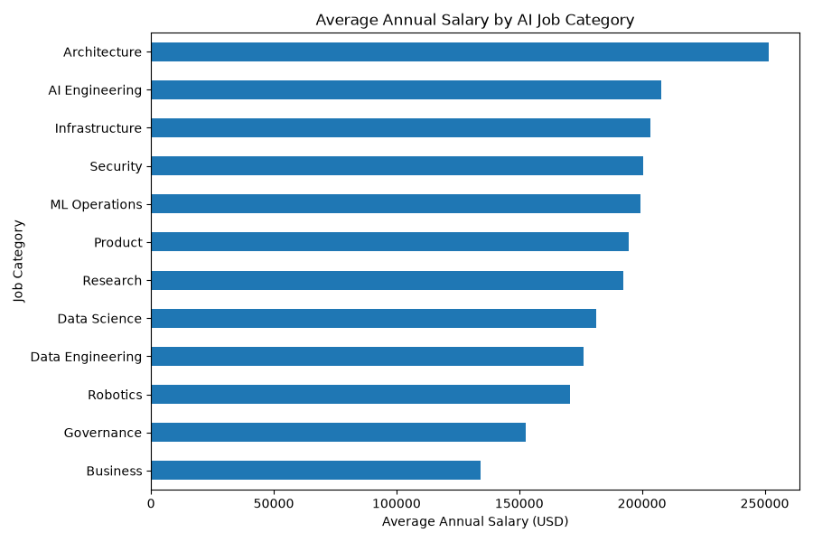
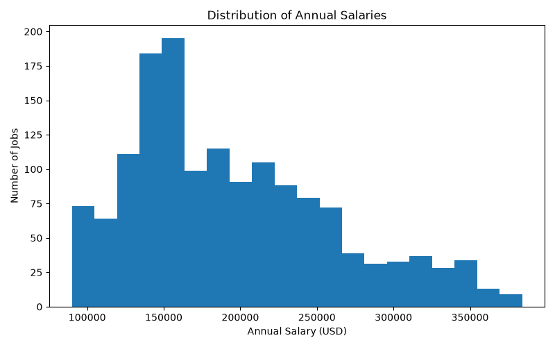
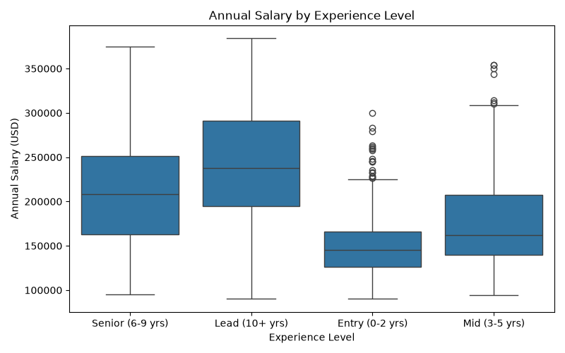
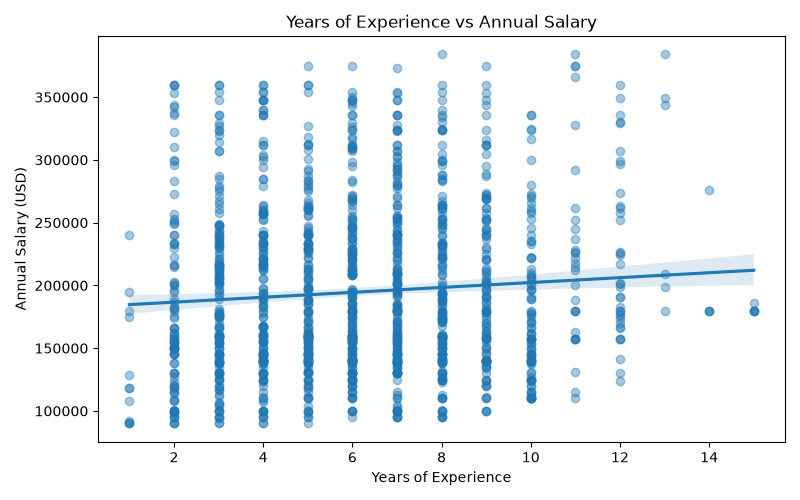
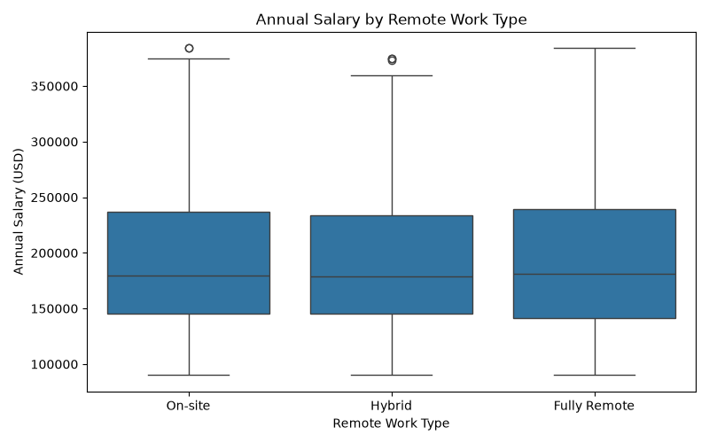
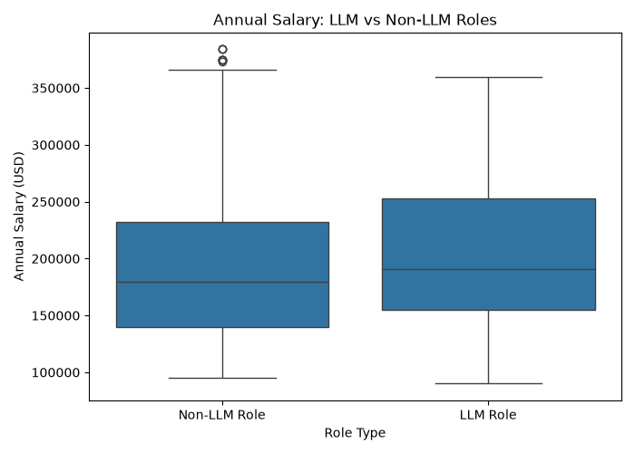
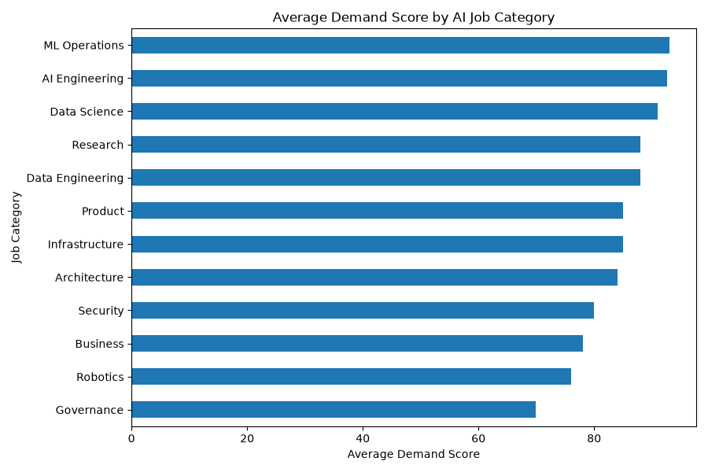
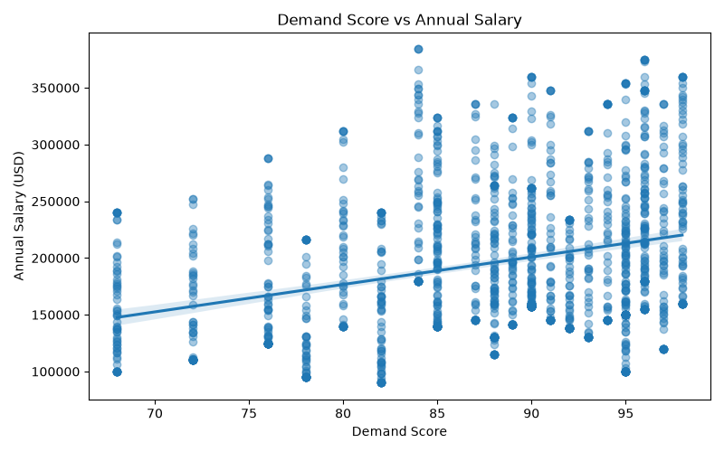

# IDS706-AI-Jobs-Project

# AI Jobs Market Analysis

[](https://github.com/yihanc09/IDS706-AI-Jobs-Project/actions/workflows/test.yml)

## Project Overview

This project analyzes a dataset of 1,500 AI job postings and 25
variables to explore salary patterns, job demand, remote-work
opportunities, and differences across AI job categories. The project
also uses a multiple linear regression model to examine how several job
characteristics are associated with annual salary.

The main real-world question is:

> **What characteristics of AI jobs are associated with differences in
> salary and demand, and how can a small data-analysis workflow be made
> reliable, reproducible, and portable?**

The project began as a basic exploratory analysis using Pandas,
Matplotlib, Seaborn, and scikit-learn. Across the three-week project, it
was expanded and refactored into a reproducible workflow with reusable
functions, automated tests, continuous integration, code-quality tools,
and Docker containerization.

The analysis includes:

-   Data loading and inspection
-   Data-quality diagnostics
-   Missing-value and duplicate checks
-   IQR-based salary outlier detection
-   Filtering and grouping
-   Eight exploratory visualizations
-   Multiple linear regression for salary prediction
-   Pandas and Polars performance comparison
-   Unit, edge-case, and system testing with `pytest`
-   Continuous integration with GitHub Actions
-   Code-quality support with Black and Flake8
-   Docker containerization
-   Reproducible commands through a Makefile

## Dataset

The dataset used in this project, `ai_jobs_market_2025_2026.csv`, was obtained from Kaggle:

[AI Jobs Market 2025–2026 & Salaries](https://www.kaggle.com/datasets/alitaqishah/ai-jobs-market-2025-2026-salaries)

It contains 1,500 observations and 25 columns.

Some important variables include:

- `job_title`: Title of the AI-related position
- `job_category`: General category of the position
- `experience_level`: Required experience level
- `years_of_experience`: Number of years of experience
- `annual_salary_usd`: Annual salary in U.S. dollars
- `country`: Country associated with the job
- `remote_work`: Whether the position is on-site, hybrid, or fully remote
- `industry`: Industry of the employer
- `demand_score`: Measure of demand for the position
- `is_llm_role`: Indicates whether the position is related to large language models
- `is_senior`: Indicates whether the position is a senior role
- `is_remote_friendly`: Indicates whether the position supports remote work

## Project Structure

```text
IDS706-AI-Jobs-Project/
├── .github/
│   └── workflows/
│       └── test.yml
├── figures/
├── src/
│   └── main.py
├── tests/
│   └── test_main.py
├── .dockerignore
├── .flake8
├── .gitignore
├── ai_jobs_market_2025_2026.csv
├── polars_comparison.py
├── Dockerfile
├── Makefile
├── requirements.txt
└── README.md
```

## Setup

### 1. Clone the repository

``` bash
git clone https://github.com/yihanc09/IDS706-AI-Jobs-Project.git
cd IDS706-AI-Jobs-Project
```

### 2. Install dependencies

``` bash
python3 -m pip install -r requirements.txt
```

or:

``` bash
make install
```

### 3. Run the analysis

``` bash
python3 src/main.py
```

or:

``` bash
make run
```

Running the analysis loads and inspects the data, prints data-quality
diagnostics and summary results, trains the regression model, and
generates all eight plots in the `figures/` directory.

The Pandas and Polars performance comparison can be run separately with:

```bash
python3 polars_comparison.py
```

## Data Inspection

The dataset is first inspected using:

-   `.head()` to preview observations
-   `.info()` to inspect dimensions and data types
-   `.describe()` to examine summary statistics
-   `.isnull().sum()` to check missing values
-   `.duplicated().sum()` to check duplicated rows

The dataset contains **1,500 rows and 25 columns**, with **no missing
values** and **no duplicated rows**.

The mean annual salary is approximately **\$194,892**, the median is
approximately **\$180,000**, and salaries range from approximately
**\$90,000 to \$384,000**.

### Data Quality and Outlier Treatment

As an additional project enhancement, I created a reusable
`summarize_data_quality()` function. It reports:

-   Number of rows and columns
-   Total missing values
-   Number of duplicated rows
-   Minimum and maximum salary
-   Number of potential salary outliers
-   Lower and upper salary-outlier bounds

Potential salary outliers are identified using the **1.5 × IQR rule**:

``` text
Lower bound = Q1 - 1.5 × IQR
Upper bound = Q3 + 1.5 × IQR
```

The workflow reports potential salary outliers rather than automatically
deleting them. High salaries can represent meaningful variation in
senior, specialized, or high-demand AI positions rather than data-entry
errors. Because the dataset contains no missing values or duplicated
rows, no imputation or duplicate removal is required.

This data-quality summary was added as an original improvement to make
data validation more explicit and reproducible.


## Filtering and Grouping

Reusable filtering functions examine several useful subsets of the AI
job market.

The analysis finds:

-   **515** jobs located in the USA
-   **445** fully remote jobs
-   **148** jobs that are both fully remote and located in the USA
-   **607** jobs with annual salaries above \$200,000

The data is also grouped by variables such as job category, remote-work
arrangement, and LLM-role status.

The category with the highest average annual salary is **Architecture**,
at approximately **\$251,577**.

Selected average salaries by category include:

-   AI Engineering: approximately \$207,982
-   Infrastructure: approximately \$203,527
-   Security: approximately \$200,400
-   Data Science: approximately \$181,276
-   Governance: approximately \$152,516
-   Business: approximately \$134,145

AI Engineering is also the largest category in the dataset, with **736
positions**.

## Visualizations

The final workflow automatically generates **eight figures**.

### 1. Average Annual Salary by AI Job Category

This horizontal bar chart compares the average annual salary across AI job categories.



The visualization shows substantial salary differences between job categories. Architecture has the highest average salary, while Business and Governance are among the lower-paying categories in this dataset.

### 2. Distribution of Annual Salaries

This histogram shows the overall distribution of annual salaries in the dataset.



The salaries cover a wide range, from $90,000 to $384,000, with an average salary of approximately $194,892.

### 3. Annual Salary by Experience Level

This boxplot compares salary distributions across different experience levels.



The plot helps show both the typical salary and the variation in salaries within each experience-level group.

### 4. Years of Experience vs. Annual Salary

This scatter plot examines the relationship between years of experience and annual salary.



The points show substantial salary variation even among jobs requiring similar numbers of years of experience. This suggests that years of experience alone may not be enough to explain differences in salary.

### 5. Annual Salary by Remote Work Type



This boxplot compares salary distributions for different remote work arrangements.

### 6. Annual Salary: LLM vs. Non-LLM Roles



This visualization compares salary distributions between LLM-related and non-LLM roles.

### 7. Average Demand Score by AI Job Category



This chart compares average demand scores across AI job categories.

### 8. Demand Score vs. Annual Salary



This plot explores whether jobs with higher demand scores also tend to have higher salaries.

## Machine Learning

The project uses **multiple linear regression** to predict
`annual_salary_usd`.

The target variable is:

```text
annual_salary_usd
```

The model uses seven input features:

```text
years_of_experience
demand_score
ai_salary_premium_pct
benefits_score_10
is_senior
is_remote_friendly
is_llm_role
```

The dataset is split into:

- 80% training data
- 20% testing data

A fixed `random_state=42` is used to make the train/test split reproducible.

Model performance is evaluated using:

- **Mean Absolute Error (MAE)**
- **R-squared (R²)**

This expanded model allows salary to be explored using multiple job characteristics instead of relying only on years of experience.

## Model Results

The linear regression produced approximately:

```text
Mean Absolute Error: $43646.35
R-squared: 0.265
```

The MAE indicates that the model's salary predictions differ from the actual salaries by approximately **$43,646** on average.

The R-squared value of approximately **0.265** indicates that the seven features in the model explain about 26.5% of the variation in annual salary in the test data.

Compared with using years of experience alone, the expanded model incorporates additional job characteristics such as demand, AI salary premium, seniority, remote friendliness, and whether the position is LLM-related. However, much of the variation in salary remains unexplained, suggesting that other factors such as job category, industry, location, and company characteristics may also be important.

## Pandas vs. Polars Performance Comparison

In addition to the Pandas analysis, I used Polars to perform the same dataframe operations and compare their performance. The comparison included filtering jobs in the USA, filtering fully remote jobs, filtering fully remote jobs in the USA, filtering jobs with an annual salary above $200,000, calculating the average salary by job category, and counting the number of jobs by job category.

Each operation was repeated 100 times, and the average execution time was calculated.

The performance results were:

```text
Filter: USA jobs
Pandas: 0.000313 seconds
Polars: 0.001163 seconds

Filter: fully remote jobs
Pandas: 0.000263 seconds
Polars: 0.001013 seconds

Filter: fully remote USA jobs
Pandas: 0.000345 seconds
Polars: 0.000987 seconds

Filter: salary above $200,000
Pandas: 0.000216 seconds
Polars: 0.001025 seconds

Group by job category: average salary
Pandas: 0.000213 seconds
Polars: 0.000750 seconds

Group by job category: job count
Pandas: 0.000172 seconds
Polars: 0.000226 seconds
```

For this dataset, Pandas was faster for filtering and grouping, while Polars was slightly faster for sorting. Since the dataset contains only 1,500 rows, all of the operations completed very quickly and the performance differences were small.

The Pandas and Polars analyses also produced the same results. For example, both returned 515 USA jobs, 445 fully remote jobs, 148 fully remote USA jobs, and 607 jobs with salaries above $200,000. The grouped average salaries and job counts by category were also consistent between the two libraries.

## Automated Testing

Automated tests are implemented using **pytest** to verify the reliability of the analysis workflow.

The test suite contains **10 tests** covering typical behavior,
meaningful edge cases, model execution, and the complete workflow.

The tests cover:

- Data loading
- Data-quality summary generation
- USA job filtering
- USA filtering when no matching observations exist
- Fully remote USA job filtering
- High-salary job filtering
- High-salary filtering edge case
- Salary grouping by job category
- Machine learning model training and evaluation
- Complete system execution and visualization generation

Two meaningful edge cases are explicitly tested:

1.  A dataset containing no USA jobs should return an empty DataFrame
    rather than fail.
2.  An extremely high salary threshold should return an empty DataFrame
    rather than fail.

The machine learning test verifies that the model is successfully trained using all seven features and that valid evaluation metrics are returned.

The system test runs the complete `main()` workflow and confirms that all eight expected visualization files are successfully generated.

Run all tests with:

```bash
pytest
```

or with the Makefile:

```bash
make test
```

A successful test run should show:

```text
10 passed
```

## Continuous Integration

This project uses **GitHub Actions** for continuous integration. The
workflow is stored in:

``` text
.github/workflows/test.yml
```

Whenever changes are pushed to the repository, the CI workflow automatically sets up the Python environment, installs the required dependencies, and runs the test suite.

This ensures that changes to the project do not accidentally break the data analysis workflow.

The CI status badge at the top of this README provides a quick indication of whether the latest GitHub Actions workflow completed successfully.

### CI / Test Evidence

``{=html}

``{=html}

## Docker and Containerization

A `Dockerfile` is included so the project can run in a consistent Python
3.12 environment with all required dependencies installed.

### Basic Docker Practice

The project supports the standard Docker workflow:

``` bash
docker pull python:3.12-slim
docker build -t ai-jobs-project .
docker images
docker run --rm ai-jobs-project
docker ps
```

The same workflow is available through the Makefile.

### Build the image

``` bash
make docker-build
```

### Run the analysis inside the container

``` bash
make docker-run
```

### Run the tests inside the container

``` bash
make docker-test
```

The Docker workflow showed how containerization packages the code,
Python runtime, and dependencies into the same environment. This reduces
differences between local machines and makes the analysis easier to
reproduce.

### Docker Evidence


## Refactoring and Code Quality

The original project was written primarily as a sequential analysis
script. The final version was refactored into smaller reusable functions
so that individual parts of the workflow can be understood, reused, and
tested independently.

Major refactoring improvements include:

-   Extracting data loading into `load_data()`
-   Separating inspection into `inspect_data()`
-   Adding `summarize_data_quality()` for reusable data validation
-   Separating each filtering operation into a dedicated function
-   Separating grouping calculations into reusable functions
-   Creating individual visualization functions
-   Creating `save_figure()` to remove repeated figure-saving code
-   Moving model training and evaluation into `train_salary_model()`
-   Keeping `main()` as the coordinator of the complete workflow
-   Adding readable labels for LLM vs. non-LLM roles
-   Updating tests after refactoring

These changes improve readability and reduce duplicated code. More
importantly, they make core analytical operations independently
testable.

### Code-Quality Tools

`black` and `flake8` are included in `requirements.txt`.

Formatting can be checked with:

``` bash
black --check src tests
```

Code style can be checked with:

``` bash
flake8 src tests
```

The repository also includes a `.flake8` configuration file.

### Verification After Refactoring

The refactored project was verified at multiple levels:

``` bash
make test
make docker-build
make docker-test
make docker-run
```

The automated test suite checks individual functions as well as the
complete workflow, while the Docker test confirms that the project also
works in a clean containerized environment.

### Refactoring Commit Diff


## Makefile

A `Makefile` is included to provide simple and reproducible commands for common development tasks.

``` bash
make install
make test
make run
make docker-build
make docker-test
make docker-run
make clean
```

This reduces the need to remember longer commands and helps keep local
and containerized workflows consistent.

## Key Findings

Overall, the analysis shows that:

-   The dataset is complete, with no missing or duplicated observations.
-   About one-third of the postings are located in the USA.
-   The dataset contains 445 fully remote positions.
-   Salaries vary substantially across AI job categories.
-   Architecture has the highest average salary among the categories in
    this dataset.
-   AI Engineering is the largest job category in the dataset.
-   Salary variation remains substantial even among jobs with similar
    experience requirements.
-   Remote-work arrangement and LLM-role status provide additional
    dimensions for comparing salary distributions.
-   Demand score can be examined alongside salary to explore how market
    demand relates to compensation.
-   A seven-feature linear regression explains only part of salary
    variation, showing the limitations of relying on a small set of
    numeric and binary predictors.
-   Explicit data-quality checks, tests, CI, and Docker make the
    analysis more reliable and reproducible than the original
    exploratory script.

## Original Project Enhancements

Beyond the initial assignment requirements, I added several
project-specific improvements:

-   A reusable **Data Quality Summary**
-   IQR-based salary outlier diagnostics
-   Additional salary and demand visualizations
-   Human-readable labels for LLM vs. non-LLM roles
-   An expanded seven-feature salary model
-   Edge-case tests for empty filtering results
-   A Pandas vs. Polars performance comparison
-   A system test that verifies all expected visualization outputs

These additions connect software-engineering practices with the
analytical goal of understanding the AI job market.

## Limitations and Future Work

This dataset is relatively small and represents a specific snapshot of
the AI job market, so the findings should not be interpreted as a
complete representation of all AI employment.

Future improvements could include:

-   Adding categorical variables such as industry, country, and job
    category to the predictive model
-   Comparing linear regression with tree-based or regularized models
-   Using cross-validation for more robust model evaluation
-   Studying interaction effects among experience, job category, remote
    work, and LLM specialization
-   Testing the Pandas--Polars comparison on much larger datasets
-   Adding more edge-case tests for malformed or missing input data
-   Extending the workflow to newer or continuously updated job-market
    data

## Final Reproducibility Checklist

A new user should be able to reproduce the project by running:

``` bash
make install
make test
make run
```

or, using Docker:

``` bash
make docker-build
make docker-test
make docker-run
```
